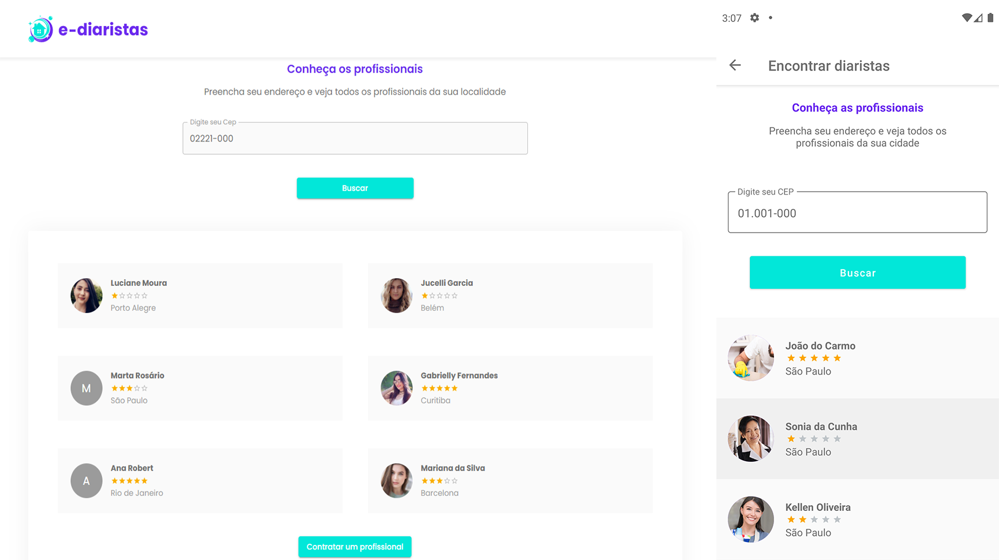

<h1 align="center">
    
</h1>

<p align="center">
  <a href="#rocket-tecnologias">Tecnologias</a>&nbsp;&nbsp;&nbsp;|&nbsp;&nbsp;&nbsp;
  <a href="#-projeto">Projeto</a>&nbsp;&nbsp;&nbsp;|&nbsp;&nbsp;&nbsp;
  <a href="#rodando">Rodando</a>&nbsp;&nbsp;&nbsp;|&nbsp;&nbsp;&nbsp;
</p>

<a id="-projeto">
<p align="center">
 

  
</p>

<br>

<p align="center">
  
</p>

<a id="rocket-tecnologias"></a>

## 🚀 Tecnologias

O Backend da aplicação foi desenvolvido com as seguintes tecnologias:

       

<a id="run"></a>

## :running: Rodando o projeto

### 💻 Pré-requisitos

Antes de começar, verifique se você atendeu aos seguintes requisitos:

- Você instalou a versão mais recente de `< Docker/ Python>`
- Você tem uma máquina `< Windows / Linux / Mac >`.
- Você possui um `< Editor de código ou IDE & Gerenciador de banco de dados >`.

## ☕ Pequena ajuda

Preencha o arquivo `.env.example`, localizado em `./ediaristas`, com as informações cobradas e depois renomeie para `.env`.

```env
SECRET_KEY=
DEBUG=

# Ignore o DATABASE_URL, ele é somente usado quando upado na Heroku
DATABASE_URL=

EMAIL_HOST_USER=
EMAIL_HOST_PASSWORD=

GOOGLE_API_KEY=

PAGARME_KEY=

URL_FRONTEND=http://localhost:3000

AWS_ACCESS_KEY_ID=
AWS_SECRET_ACCESS_KEY=
AWS_STORAGE_BUCKET_NAME=ediaristas-python


```

## Serviços necessários antes de rodar a aplicação:

Lembre-se de pegar as suas chaves de API nos serviços da **[AWS](hhttps://aws.amazon.com/pt/)**, do serviço de email **[Mailgun](https://www.mailgun.com)**, o serviço de mapas do **[Google](https://developers.google.com/maps/documentation/javascript/get-api-key)** e do **[Pagar.Me](https://docs.pagar.me/v2/docs/api-key-e-encryption-key)**.

## Se lembre de ter o Docker :ocean:

### UM comando só:

```bash
$ docker-compose up web
```

### Manualmente:

Crie a sua pasta de venvs:

```bash
$ python -m venv .venv && source ./.venv/bin/activate
```

Agora realize as migrações necessárias:

```bash
$ python manage.py makemigrations && python manage.py migrate
```

E por fim, rode o aplicativo:

```bash
$ python manage.py runserver
```

#### _Sinta-se livre para colaborar, toda ajuda é bem vinda ;)_

 <br/>
